# VG Hypeman

Discover your next favorite video game or catch up on one you already love. Video Game Hypeman is built to bring you everything you need know about any game. Want to see Tweets from the game’s official Twitter? Coming right up! need some livestreams in your life? No problem we’ll pull the top streams from Twitch now! Video Game Hypeman is a powerful tool in your personal arsenal. Go ahead and try it out, it’s magic.

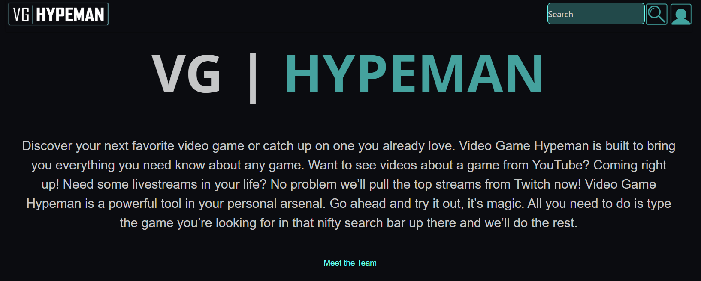

Click meet the team at the bottom of the VG Hypeman landing page to view the following -

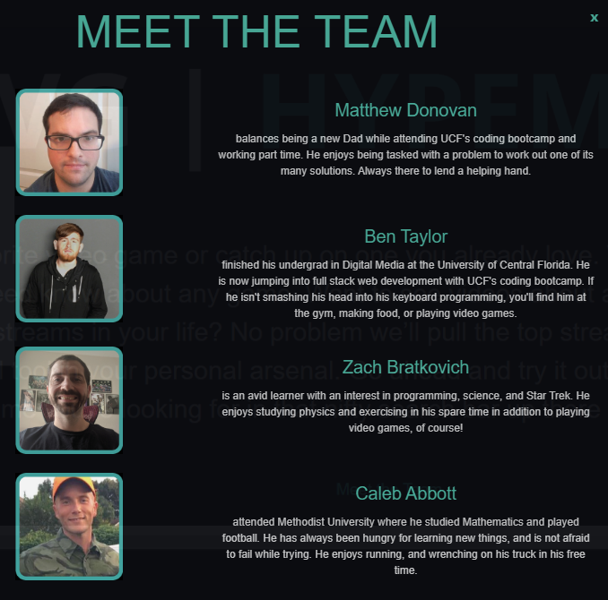

If you ever leave this Landing message you can swap between the game viewer and the Landing message with the VG Hypeman logo.

 - Logo on bigger screens.

 -  Logo on smaller screens

- - - - -

## Site Example -

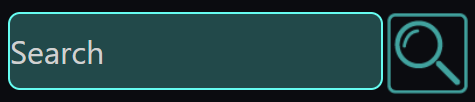 If you end up searching 'Hollow Knight ' you can view the following information -

 Click the camera icon at the bottom to view pictures from the game -

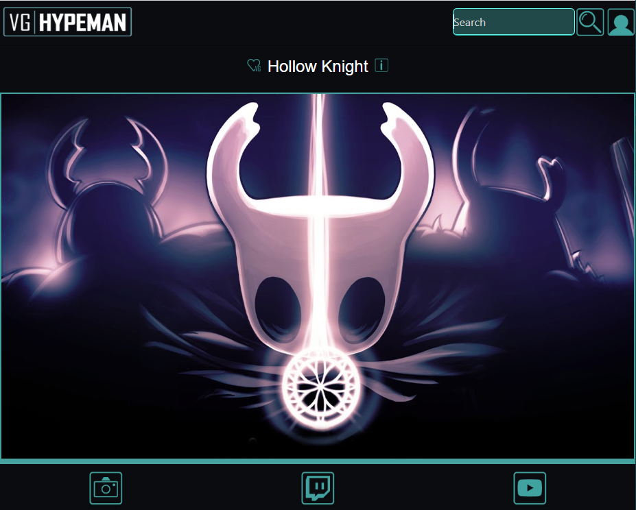

 Click the Twitch icon at the bottom to view Twitch Streams of the game -

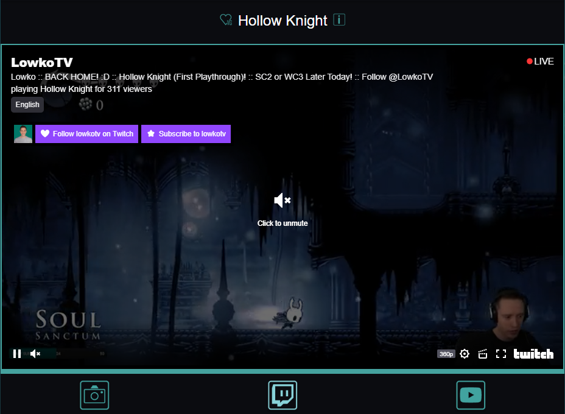

 Click the YouTube icon at the bottom to view YouTube reviews of the game -

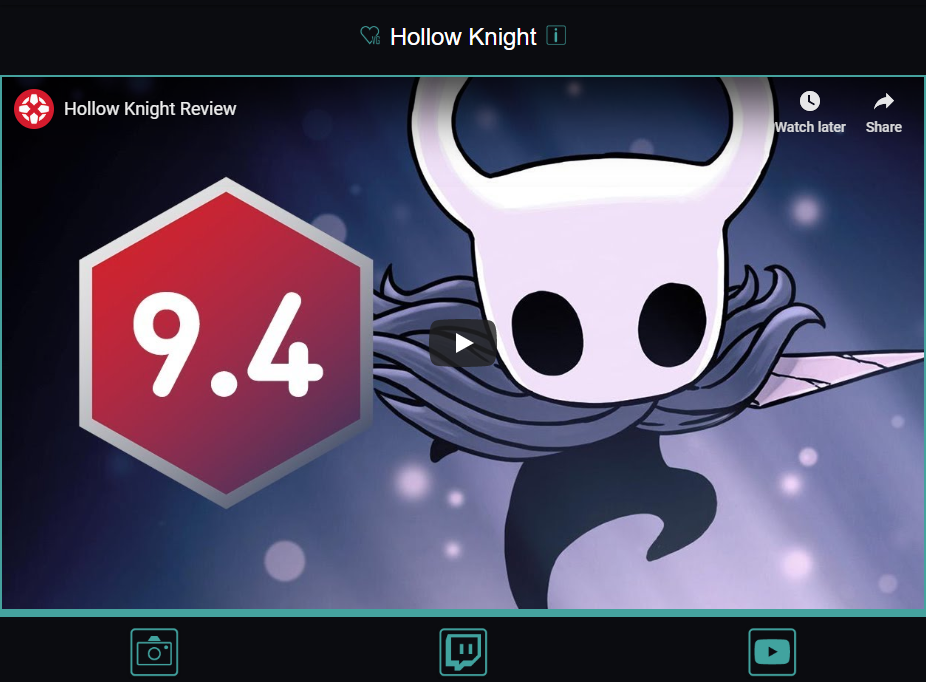

 Click the Information icon to find out more about the game - 

- - - - -

## User Profile Example -

 - Click the Profile icon at the top to Log in, Register, or open your profile section -

 

Enter your name and password and click 'LOG IN' to get access to profile features. If you don't have an account click 'REGISTER'.

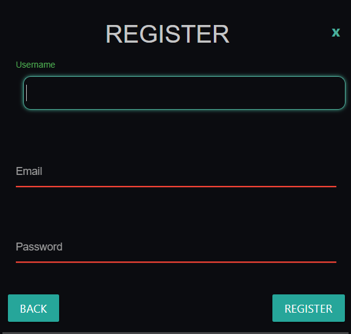 

Enter a Username, Email, and Password for your account and click 'REGISTER'.

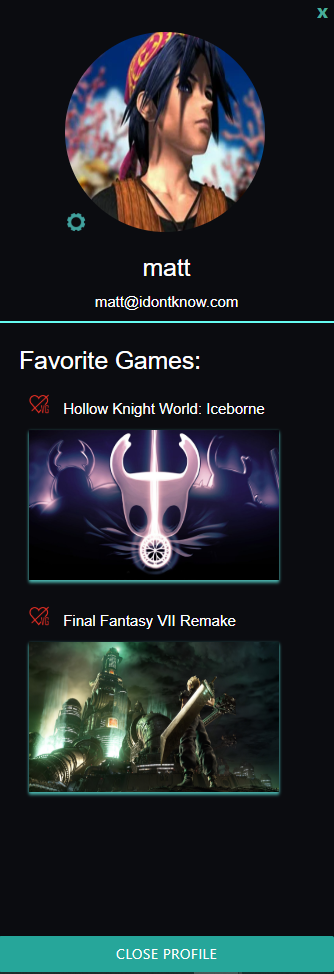 

You now have access to profile features! 

 - Click the Upload icon at the top of the profile to add a profile picture.

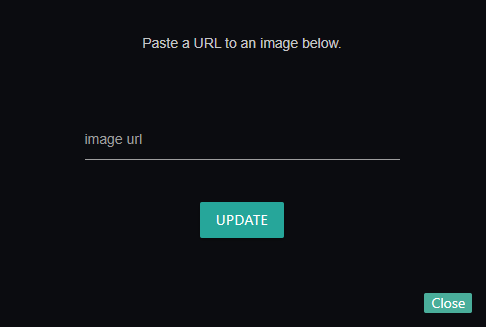 

Enter a URL of the profile picture you would like to have.

  Any time you search a game click on Heart Button to add the game to you favorites. If you click it again it will unfavorite the game

Saved games can be viewed under your profile picture. 

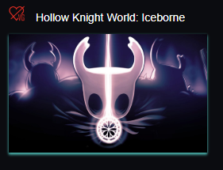 

Clicking On the picture of a saved game will bring the search results back to the viewing area.

 You can close all modals with the 'X' button.

The profile area can be closed with the button at the bottom as well

- - - - -

## Media In Another Castle -

During your searches you may come across the following picture in the viewing area.

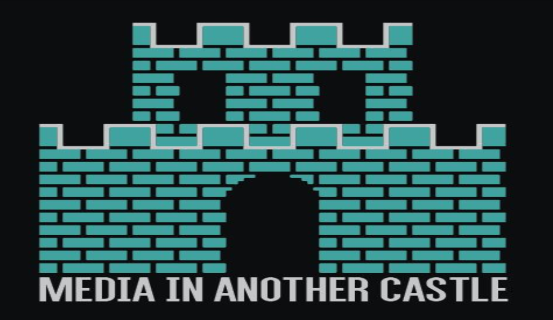

This means there was some error obtaining the information. For the most part you might see this in the YouTube viewer because there are a limited amount of searches that can be done per day.